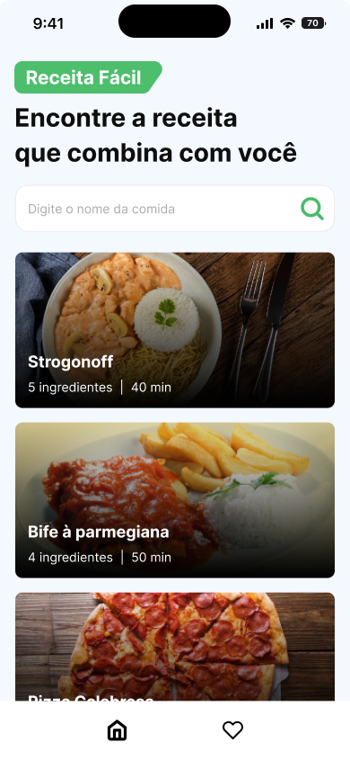
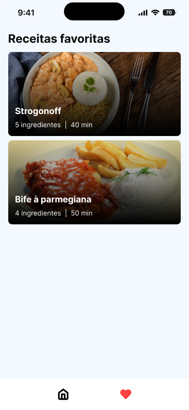
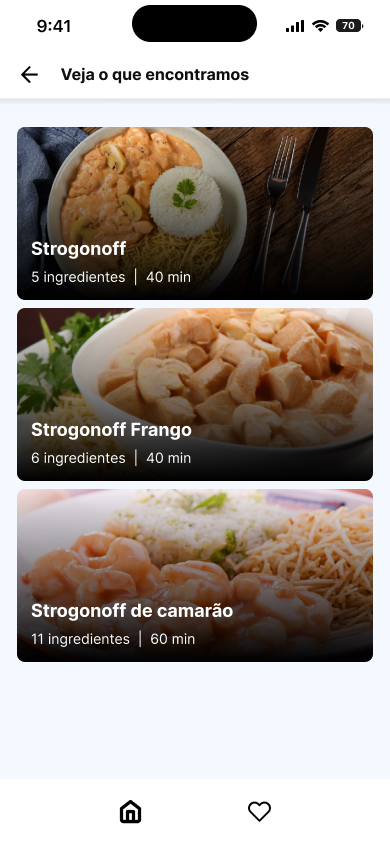

<div align="center">

[![GNU License][license-shield]][license-url]
[![Version][version-shield]][version-shield]

</div>

<br />
<div align="center">
    <a href="https://github.com/joaosouza7/receitas-app">
    
    </a>
    <br />
    <br />

  <p align="center">
    Receita Fácil
    <br />
    <a href="https://github.com/joaosouza7/receitas-app"><strong>Explore o documento »</strong></a>
    <br />
    <br />
  </p>
</div>

## 💻 Sobre o projeto

O React Native Insider é um workshop promovido pelo [Sujeito Programador][sujeito-programador], onde em cada edição há uma proposta de desenvolvimento de um projeto diferente.

Não é preciso ter conhecimento prévio para participar, já que as aulas compreendem desde o início da criação até a finalização do projeto.

A proposta desse projeto foi criar um aplicativo de receitas com [Expo][expo-url] em que o usuário tenha acesso a uma lista de receitas, disponibilizadas através de uma API fake. Além disso, é possível buscar, favoritar e filtrar as receitas disponíveis e os dados são salvos no [Async Storage][async-storage] do smartphone.

## 🔎 Preview do projeto

<div align="center">
  
  
  
</div>

<div align="center">
  
</div>


## 🛠 Tecnologias

As seguintes ferramentas foram utilizadas no desenvolvimento do projeto.

* [![HTML][html]][html-url]
* [![CSS][css]][css-url]
* [![Java Script][javascript]][javascript-url]
* [![React Native][react-native]][reactNative-url]
* [![Expo][expo]][expo-url]


## 🚀 Como executar o projeto?

### Pré-requisitos

Antes de começar, você vai precisar ter instalado em sua máquina as seguintes ferramentas:
[Git][git-url], [Node][node-url]. 
Além disto é bom ter um editor para trabalhar com o código como o [VSCode][vscode-url].

### 🎲 Rodando a aplicação

```bash
# Clone este repositório
$ git clone https://github.com/joaosouza7/receitas-app

# Acesse a pasta do projeto no terminal/cmd
$ cd receitas-app

# Instale as dependências do projeto
$ npm install

# Rode a api fake com a configuração IP do seu PC
json-server --watch -d 180 --host seuIP db.json

# Use o expo para inicializar a aplicação
$ npx expo start
```

### 📲 Rodando no Smartphone

* Baixe o aplicativo Expo Go na sua [Play Store][play-store] ou na [App Store][app-store].
* Abra o app, conceda as permissões necessárias e clique em **Scan QR Code**.
* Faça o scan do QR Code que abrir no seu CMD/terminal.
* Aguarde o aplicativo carregar.

## 📝 Licença

Esse projeto está sob a licença [GNU][license-url]. Veja o arquivo `LICENSE` para mais detalhes.

[Entre em contato!][linkedin]

<!-- LINKS E IMAGENS -->

[linkedin]: https://www.linkedin.com/in/joaosouzadesenvolvedorweb

[license-shield]: https://img.shields.io/badge/LICENSE-GNU-green?style=for-the-badge
[license-url]: ./LICENSE

[version-shield]: https://img.shields.io/badge/VERSION-1.0.0-dc3545?style=for-the-badge

[git-url]: https://git-scm.com
[node-url]: https://nodejs.org/en
[vscode-url]: https://code.visualstudio.com/
[sujeito-programador]: https://sujeitoprogramador.com/
[async-storage]: https://reactnative.dev/docs/asyncstorage
[play-store]: https://play.google.com/store/games?hl=pt_BR&gl=US
[app-store]: https://www.apple.com/br/app-store/

[html]: https://img.shields.io/badge/HTML-239120?style=for-the-badge&logo=html5&logoColor=white
[html-url]: https://developer.mozilla.org/en-US/docs/Web/HTML

[css]: https://img.shields.io/badge/-CSS-blue?style=for-the-badge&logo=css3&logoColor=white
[css-url]: https://www.w3.org/Style/CSS/Overview.en.html

[expo]: https://img.shields.io/badge/-Expo-%23000020?style=for-the-badge&logo=expo
[expo-url]: https://expo.dev/

[javascript]: https://img.shields.io/badge/JavaScript-323330?style=for-the-badge&logo=javascript&logoColor=F7DF1E
[javascript-url]: https://developer.mozilla.org/en-US/docs/Web/JavaScript

[react-native]: https://img.shields.io/badge/React_Native-20232A?style=for-the-badge&logo=react&logoColor=61DAFB
[reactNative-url]: https://reactnative.dev/